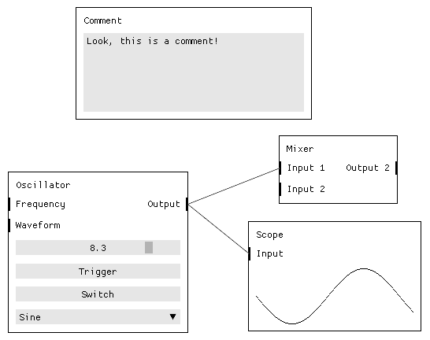

# Gazpatcho

A Rust library providing a graphical node-based graph editor.

<p align="center">
  
</p>

This library can be used as to draw a user interface, allowing users to model
graphs that would be later interpreed and acted upon by the backend of the
application.

There are four main parts of the API:

* `Config` structure defined on the start of the application. This structure
  specifies all the available node types, their inputs, outputs and widgets
  taking associated data.
* `Report` structure which is returned by the running instance of Gazpatcho on
  every change performed on the graph (added or removed nodes, changed values,
  added or removed patches). This structure discribes the graph and associated
  data.
* `run` function which has two parameters: The `Config` and a closure taking
  current `Report` as its argument.
* `Request` enumeration of all operations that can be sent to the running
  instance of the graph to alter its state.

Documentation:

* [API reference (docs.rs)](https://docs.rs/gazpatcho)
* [Repository (github.com)](https://github.com/zlosynth/gazpatcho)
* [Crate (crates.io)](https://crates.io/crates/gazpatcho)

## Usage

Add the following to your `Cargo.toml`:

``` toml
[dependencies]
gazpatcho = "1.0"
```

The following code runs an instance of Gazpatcho UI. There will be a single type
of node available, with one input and one output pin, and with switch that can
be set on or off by the user. When the user performs any changes, a new report
will be sent to the `run` callback, desribing the current state of the graph. In
a real application, the `dbg!` call would be replaced by something more useful:

``` rust
use gazpatcho::config::*;

fn main() {
    let config = Config {
        node_templates: vec![
            NodeTemplate {
                label: "Example node".to_owned(),
                class: "example_node".to_owned(),
                pins: vec![
                    Pin {
                        label: "Input".to_owned(),
                        class: "in".to_owned(),
                        direction: Input,
                    },
                    Pin {
                        label: "Output".to_owned(),
                        class: "out".to_owned(),
                        direction: Output,
                    },
                ],
                widgets: vec![Switch {
                    label: "Switch".to_owned(),
                    key: "switch".to_owned(),
                }],
            }
        ],
    };

    gazpatcho::run_with_callback("Application Name", config, |report| {
        // Act upon the current report
        dbg!(report);

        // Respond with change requests
        vec![
            // Request::SetValue { ... }
        ]
    });
}
```

See the [documentation](https://docs.rs/gazpatcho) to learn more about the
`Config` and `Report` structures. If you prefer tinkering with code over reading
documentation, see and try included [examples](examples/):

``` shell
cargo run --example main
```

# License

Gazpatcho is distributed under the terms of the General Public License
version 3. See [LICENSE](LICENSE) for details.

# Changelog

Read the [CHANGELOG.md](CHANGELOG.md) to learn about changes introduced in each
release.
